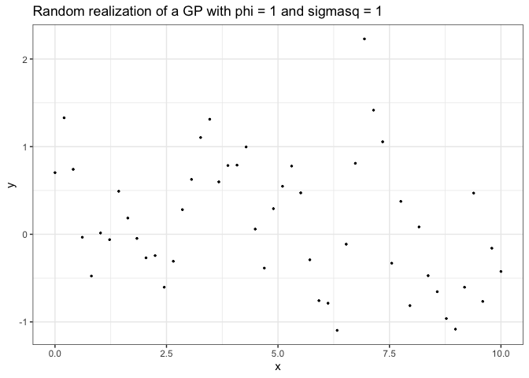
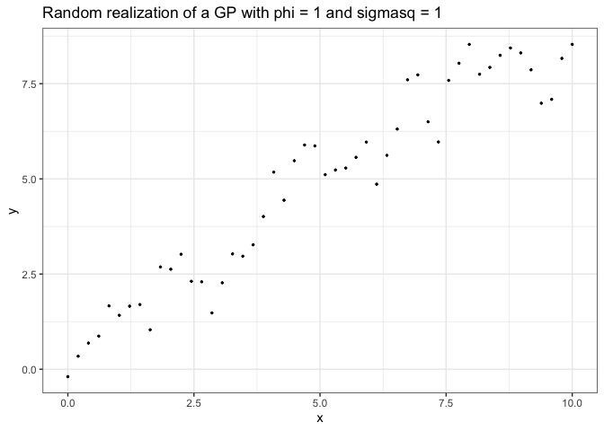
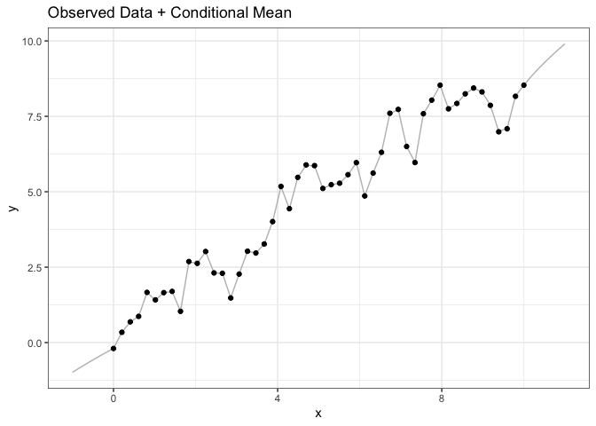
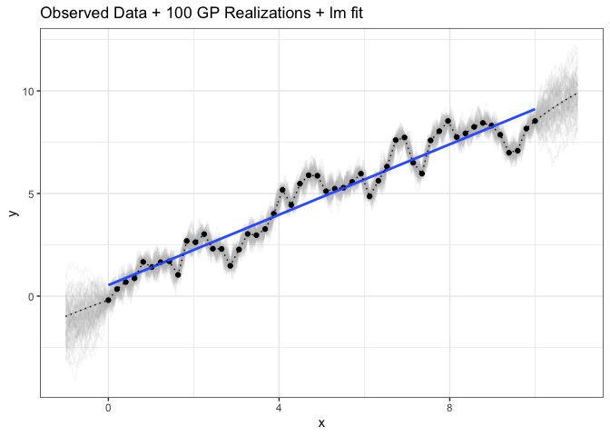

Lecture 8: GP demo
================

#### Conditional Normal distribution

Continuing the theme from last week, now there is one more location that
we are interested in learning the temperature, maybe Rendezvous Ski
Trails in West Yellowstone.

Let’s assume that
\[\begin{bmatrix} y_{bridger}\\ y_{big sky}\\ y_{rendezvous} \end{bmatrix} \sim N(\begin{bmatrix} 15 \\ 15 \\ 15\end{bmatrix}, 100\begin{bmatrix} 1 & .3 & .2 \\ .3 & 1 & .5 \\ .2 & .5 & 1
\end{bmatrix})\]

###### 1\. Simulate one data point for Bridger and Big Sky

Simulate a single realization from the distribution for Bridger and Big
Sky (ignoring Rendezvous for now).

``` r
mu <- c(15, 15, 12)
H <- matrix(c(1, .3, .2,
              .3, 1, .5,
              .2, .5, 1), byrow = T, ncol = 3, nrow = 3)
Sigma <- 100 * H

fake_temperatures1 <- rmnorm(1, mu[1:2] , Sigma[1:2, 1:2])
```

The temperatures for Bridger Bowl and Big Sky are approximately 24.3,
28.6.

###### 2\. Estimate Rendezvous, conditional on the data point from Bridger and Big Sky

Conditional on the values from the previous question, construct the
distribution for the Rendezvous temperature. Add this to a graph with a
marginal temperature. Rerun this a few times (with a different seed) to
see how it changes.

``` r
mu_given <- mu[3] + Sigma[3,1:2] %*% solve(Sigma[1:2,1:2]) %*% (fake_temperatures1 - mu[1:2])
sigma_given <- Sigma[3,3] - Sigma[3,1:2] %*% solve(Sigma[1:2,1:2]) %*% Sigma[1:2, 3]

x_seq <- seq(-15, 35, by = 1)

tibble(x = rep(x_seq,2), 
       dens = c(dnorm(x_seq, mu[3], sqrt(Sigma[3,3])), 
                dnorm(x_seq, mu_given, sqrt(sigma_given))),
      type = rep(c('marginal','conditional'), each = length(x_seq) )) %>% ggplot(aes(x = x, y = dens, group = type, color = type)) + geom_line() + theme_bw() + geom_vline(xintercept = fake_temperatures1)
```


#### GP in 1D

Recall our simulated Gaussian process in 1D

``` r
phi <- 1
sigmasq <- 1
n <- 50
x <- seq(0, 10, length.out = n)
d <- sqrt(plgp::distance(x))
eps <- sqrt(.Machine$double.eps) 
H <- exp(-d/phi) + diag(eps, n) 
y <- rmnorm(1, rep(0,n),sigmasq * H)
tibble(y = y, x = x) %>% ggplot(aes(y=y, x=x)) +
  theme_bw() + ggtitle('Random realization of a GP with phi = 1 and sigmasq = 1') +
  geom_point(size = .5)
```

<!-- -->

We have simulated y \~ N(mu, sigmasq \* H(phi)), where H(phi) is a
correlation matrix from exp(-d/phi).

##### STAN CODE

Let’s first write stan code to estimate phi, sigmasq and mu

``` r
GP_params <- stan("GP1d.stan", 
                  data=list(N = n, 
                            y = y,
                            dist = d),
                  iter = 5000)

#shinystan::launch_shinystan(GP_params)
```

``` r
print(GP_params, pars = c('phi', 'mu','sigmasq'))
```

    ## Inference for Stan model: GP1d.
    ## 4 chains, each with iter=5000; warmup=2500; thin=1; 
    ## post-warmup draws per chain=2500, total post-warmup draws=10000.
    ## 
    ##         mean se_mean   sd  2.5%   25%  50%  75% 97.5% n_eff Rhat
    ## phi     0.93    0.00 0.23  0.58  0.76 0.89 1.06  1.47  4929    1
    ## mu      0.13    0.01 0.40 -0.65 -0.13 0.13 0.39  0.92  6183    1
    ## sigmasq 1.01    0.00 0.24  0.65  0.84 0.97 1.13  1.57  5336    1
    ## 
    ## Samples were drawn using NUTS(diag_e) at Thu Feb 11 12:33:55 2021.
    ## For each parameter, n_eff is a crude measure of effective sample size,
    ## and Rhat is the potential scale reduction factor on split chains (at 
    ## convergence, Rhat=1).

#### GP regression in 1D

Now add a covariate

``` r
phi <- 1
sigmasq <- 1
n <- 50
x <- seq(0, 10, length.out = n)
beta <- 1
d <- sqrt(plgp::distance(x))
eps <- sqrt(.Machine$double.eps) 
H <- exp(-d/phi) + diag(eps, n) 
y <- rmnorm(1, x * beta,sigmasq * H)
reg_fig <- tibble(y = y, x = x) %>% ggplot(aes(y=y, x=x)) +
  theme_bw() + ggtitle('Random realization of a GP with phi = 1 and sigmasq = 1') +
  geom_point(size = .5)
reg_fig
```

<!-- -->

We have simulated y \~ N(mu, sigmasq \* H(phi)), where H(phi) is a
correlation matrix from exp(-d/phi).

##### STAN CODE

Let’s first write stan code to estimate phi, sigmasq and mu

``` r
Reg_params <- stan("GP_reg.stan", 
                  data=list(N = n, 
                            y = y,
                            x = x,
                            dist = d),
                  iter = 5000)

#shinystan::launch_shinystan(GP_params)
```

``` r
print(Reg_params, pars = c('phi', 'beta','sigmasq'))
```

    ## Inference for Stan model: GP_reg.
    ## 4 chains, each with iter=5000; warmup=2500; thin=1; 
    ## post-warmup draws per chain=2500, total post-warmup draws=10000.
    ## 
    ##         mean se_mean   sd 2.5%  25%  50%  75% 97.5% n_eff Rhat
    ## phi     0.90       0 0.22 0.57 0.75 0.87 1.02  1.44  4357    1
    ## beta    0.92       0 0.07 0.78 0.88 0.92 0.96  1.05  5620    1
    ## sigmasq 1.08       0 0.26 0.69 0.89 1.04 1.21  1.68  4754    1
    ## 
    ## Samples were drawn using NUTS(diag_e) at Thu Feb 11 12:46:06 2021.
    ## For each parameter, n_eff is a crude measure of effective sample size,
    ## and Rhat is the potential scale reduction factor on split chains (at 
    ## convergence, Rhat=1).

##### Making Predictions

For today, consider “plug in” estimates of phi, mu, and sigmasq. To make
predictions from -1 to 11.

``` r
beta_hat <- summary(Reg_params, pars = 'beta')$summary[1]
sigmasq_hat <- summary(Reg_params, pars = 'sigmasq')$summary[1]
phi_hat <- summary(Reg_params, pars = 'phi')$summary[1]
xnew <- seq(-1, 11, .025)
n_pred <- length(xnew)
d1 <- sqrt(plgp::distance(xnew))
Sigma11 <- sigmasq_hat * exp(-d1/phi_hat) + diag(eps, n_pred) 
d12 <- sqrt(plgp::distance(xnew,x))
Sigma12 <- sigmasq_hat * exp(-d12/phi_hat) 
Sigma22 <- sigmasq_hat * exp(-d/phi_hat) + diag(eps, n) 

mu_1given2 <- xnew * beta_hat + Sigma12 %*% solve(Sigma22) %*% matrix(y - x * beta_hat, nrow = length(y), ncol = 1)
Sigma_1given2 <- Sigma11 - Sigma12 %*% solve(Sigma22) %*% t(Sigma12)
```

<!-- -->

``` r
num_sims <- 100
y1_sims <- rmnorm(num_sims, mu_1given2, Sigma_1given2  )

long_sims <- y1_sims %>% melt() %>% bind_cols(tibble(x = rep(xnew, each = num_sims)))

data_and_mean + 
  geom_line(aes(y = value, x = x, group = Var1), inherit.aes = F,
            data = long_sims, alpha = .1, color = 'gray') +
  ggtitle('Observed Data + 100 GP Realizations + lm fit') + geom_point() + geom_smooth(method ='lm', formula = 'y~x', se = F) + 
  geom_line(aes(y = y_mean, x = xnew), inherit.aes = F, data = mean_line, color = 'black', linetype = 3)
```

<!-- -->
